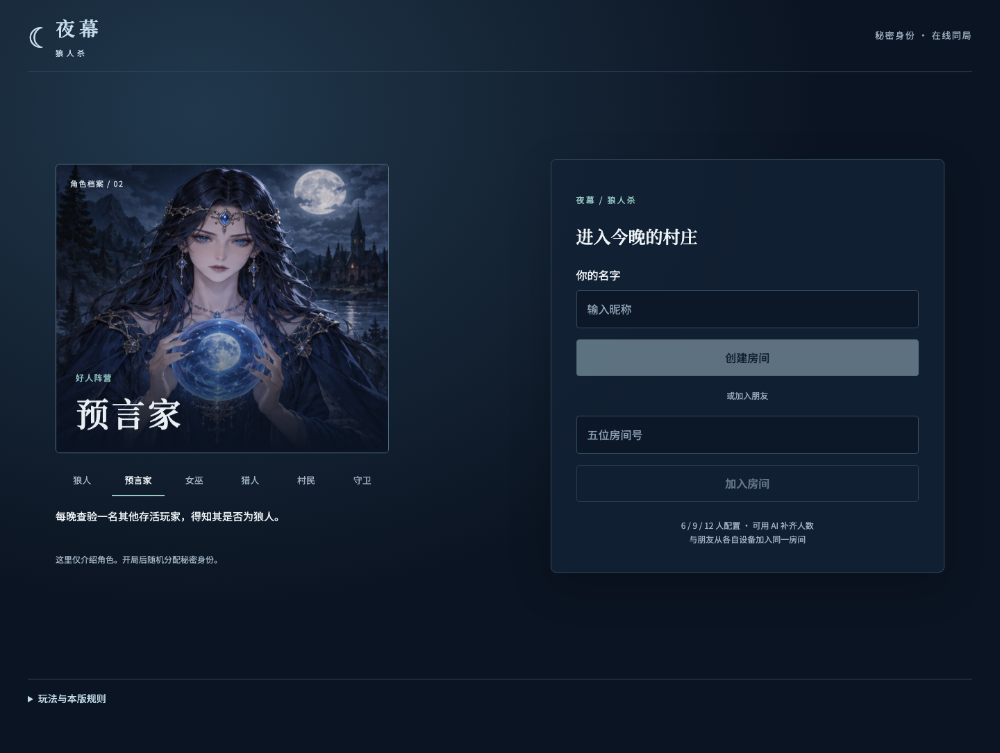
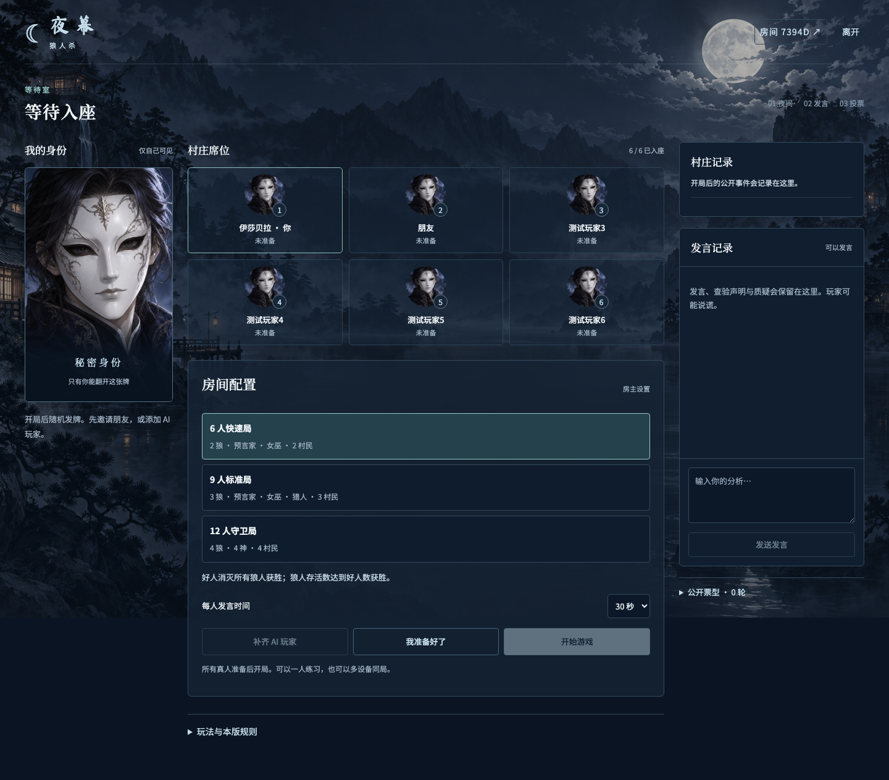
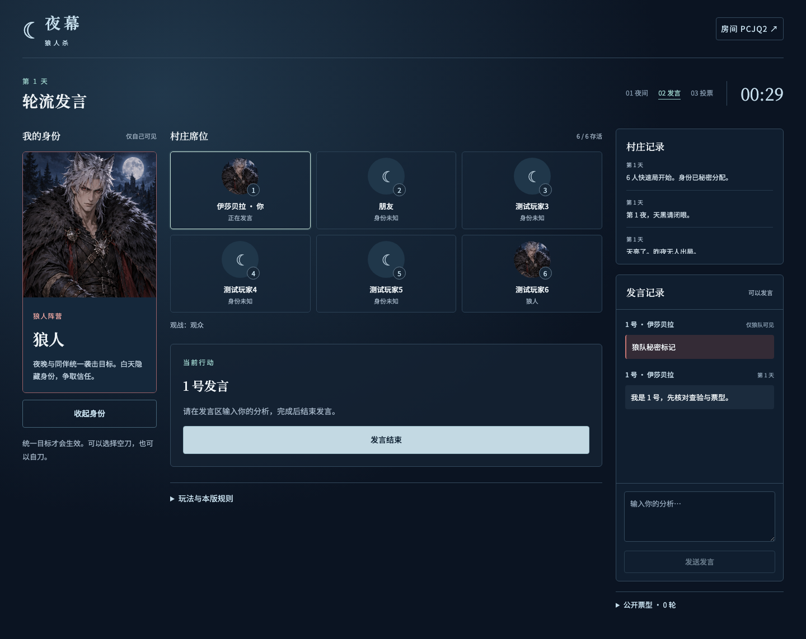
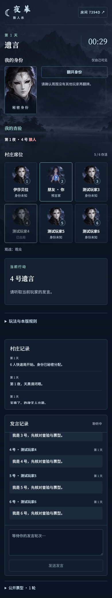
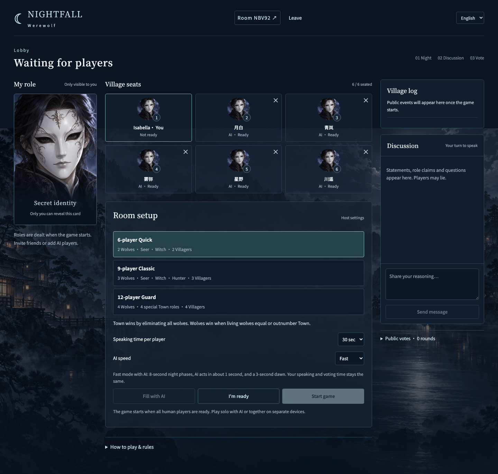
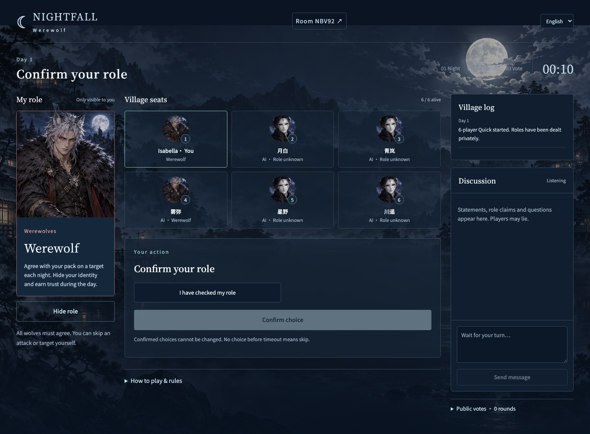
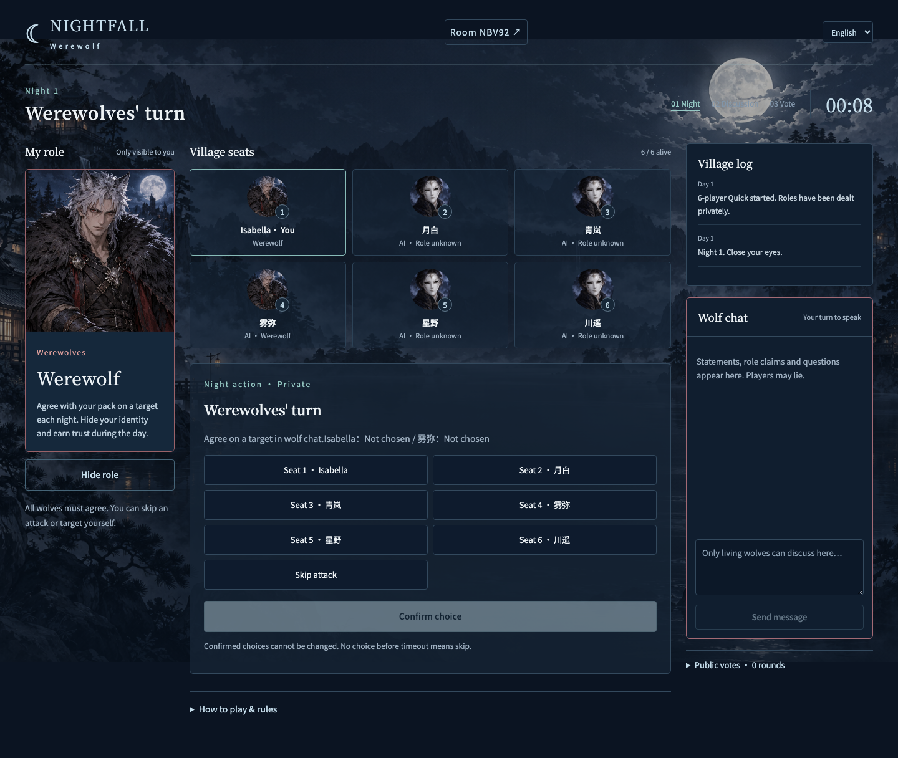
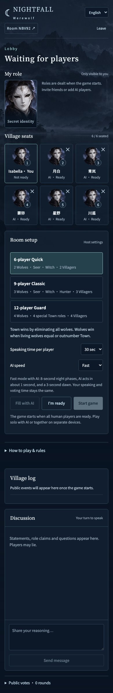
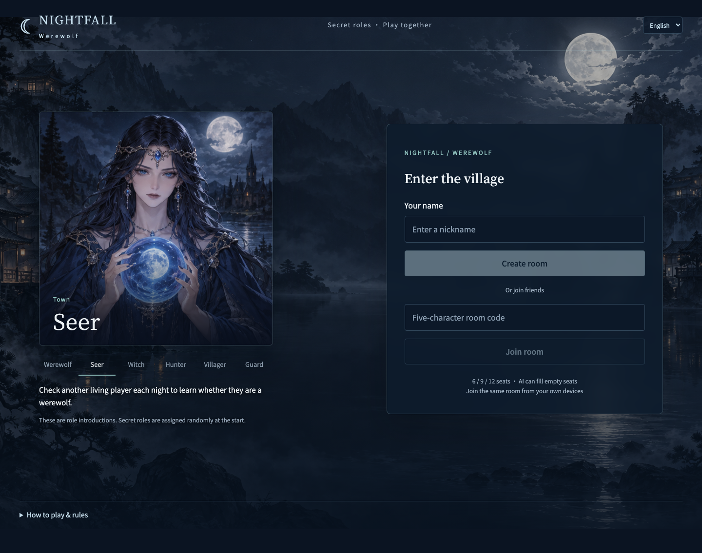

# 夜幕 · 狼人杀 / Werewolf Game

[English](README.md) | **简体中文**

支持中文与英文的独立多人狼人杀游戏，使用月夜蓝、银色与原创动漫角色牌界面。与 TRUST / FALL 分开部署、存储和维护。

## 在线游玩

[打开夜幕 · 狼人杀](https://yemu-langrensha.actionintime.chatgpt.site)

1. 输入昵称，创建房间，复制房间号或邀请链接。
2. 朋友从各自设备加入。没有足够的人时，房主点击 **补齐 AI 玩家**。
3. 所有真人准备后开始。身份随机分配，点击 **翻开身份** 查看自己的牌。
4. 根据阶段提示执行夜间技能、轮流文字发言和投票。系统同步所有设备并结算。

无需登录、安装或外部 AI API 密钥。AI 为内置策略，不是大语言模型；只接收与自己客户端相同的私密身份信息和公共记录。狼人会伪装身份，AI 的发言不代表系统认证。

## 配置与角色

| 配置 | 角色 | 狼人胜利条件 |
|---|---|---|
| 6 人快速局 | 2 狼、预言家、女巫、2 村民 | 存活狼人数达到好人数 |
| 9 人标准局 | 3 狼、预言家、女巫、猎人、3 村民 | 所有好人出局（屠城） |
| 12 人守卫局 | 4 狼、预言家、女巫、猎人、守卫、4 村民 | 全部村民或全部神职出局（屠边） |

所有配置中，好人消灭全部狼人获胜。12 个昼夜仍未分出胜负则平局。

- 夜间正常每阶段固定 15 秒；有 AI 的快速模式为 8 秒。角色是否还活着不会改变该阶段时长。
- 狼人必须统一目标，否则空刀；允许自刀。狼队讨论只有狼队可见。
- 女巫不能自救；解药、毒药各一瓶，每晚最多用一瓶。用完解药后不再显示狼刀。
- 守卫不能连续守同一人，同守同救失效。毒药无视守护。
- 猎人被狼刀或放逐可开枪，被毒杀不能开枪。狼刀已满足胜利条件时优先判定结束。
- 预言家只知道被查验者是否为狼人；结果只发送给本人。
- 白天轮流文字发言，可提前结束；发言限时由房主选择 20/30/45/60 秒。第二天起交替方向。
- 投票秘密提交，结束后公布票型。平票者 PK 发言，复投时 PK 玩家不能投票，再平票无人出局。
- 首夜和白天出局者有遗言；第二夜起夜间出局者无遗言。死亡不亮身份，猎人发动技能会公开身份，终局公开全部身份。
- 中途加入为观众。下局优先安排真人，替换 AI 座位，超出配置人数继续观战。

这是有明确范围的在线版本：**不包含警长竞选、警徽、丘比特情侣、白痴或狼人自爆**。不声称实现所有地区或所有线下变体。详细规则也可在游戏中展开阅读。

## 架构与隐私

React / Vinext → 同源 API → Cloudflare D1。浏览器每秒读取服务器权威视图；CAS 版本更新避免并发覆盖。`view()` 显式构造返回字段，隐藏其他人的身份、夜间决策、查验和凭据。未结算票型不公开。观众、死亡玩家与不在发言轮次的玩家均受服务端操作限制。

身份凭据仅保存在当前标签页的 sessionStorage；房间状态保存在独立 D1 数据库。房间 24 小时后失效，创建房间时删除超过 24 小时未更新的房间。

## 本地开发

需要 Node 22.13+。

```sh
npm ci
npm run db:local
npm run dev
```

首次本地游玩运行 `npm run db:local` 应用已提交的迁移。修改 schema 后先运行 `npm run db:generate`，再运行本地迁移。Vite 配置中的本地绑定为 `DB`，数据库 ID 为 `00000000-0000-4000-8000-000000000000`，持久目录为 `.wrangler/state`。正式发布由 Sites 应用提交的迁移。

```sh
npm run test:game
npm run test:api
npm run test:i18n
npx tsc --noEmit --incremental false
npm run build
```

规则测试覆盖角色信息隔离、狼聊、查验、药品、守卫、猎人、狼刀优先、平票、胜利条件与 24 场完整 AI 比赛。API 测试对真实处理函数使用内存 SQLite 与测试时钟，覆盖完整混合真人/AI 局、并发重试、身份验证与重开清理。浏览器验证单独运行，真实物理设备与大规模并发未做压力测试。

源码：[wuisabel-gif/langrensha](https://github.com/wuisabel-gif/langrensha)。原创图像路径及生成说明见 [角色美术](docs/art-assets.md)。

## 界面预览





<details>
<summary>手机界面</summary>



</details>

截图来自本地真实浏览器会话，示例房间号不作为长期可用邀请。

## 更多游戏截图

### 英文大厅与 AI 设置



### 查看秘密身份



### 夜间阶段



### 手机上的快速 AI 设置



## 语言与 AI 速度

在页头选择 **中文 / English**，或直接[打开英文版](https://yemu-langrensha.actionintime.chatgpt.site/?lang=en)。每位玩家独立选择语言，中英文玩家可以同房游玩。界面、规则、系统事件、操作和 AI 台词已翻译；玩家姓名与真人聊天保留原文。切换语言不会重置比赛。

房主可在大厅选择 **AI 速度 → 快速**。有 AI 玩家时，夜间每阶段 8 秒，AI 约 1 秒行动，天亮等待 3 秒；真人发言和投票时间不变。纯真人局使用正常速度。设置在重开后保留。


